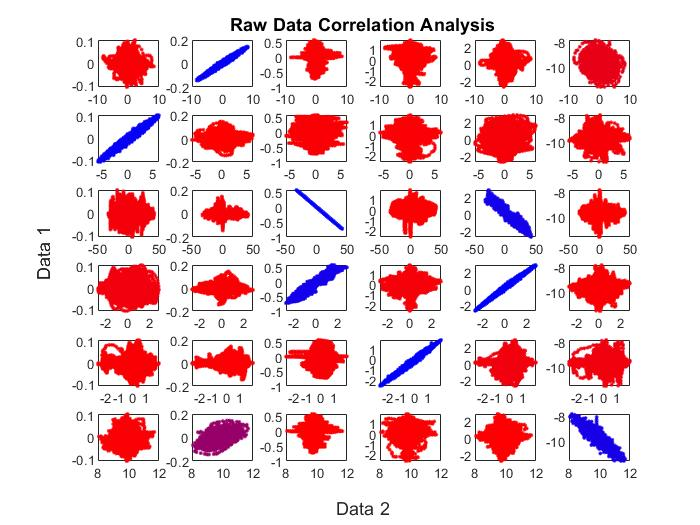
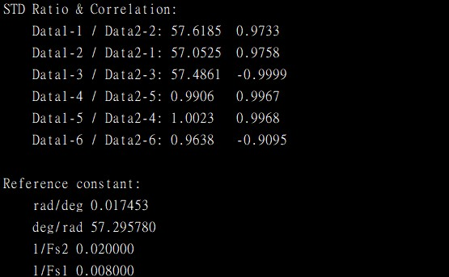

# Raw IMU Data Correlation Analysis
This project is originally created for determine the axis of test IMU data. By checking the correlation of each column in test/reference IMU data.

## Data format
> ### IMU
> | TimeStamp | Gyro_x | Gyro_y | Gyro_z | Accel_x | Accel_y | Accel_z |
> | --------- |:------:|:------:|:------:|:-------:|:-------:|:-------:|

## Output
>
>
